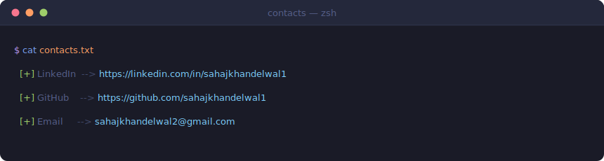

<a href="https://github.com/sahajkhandelwal1">
  
</a>

<p align="center">
  
</p>

---



---

<!-- Section: GitHub Stats -->
<div align="center">
  <table>
    <tr>
      <td>
        
      </td>
      <td>
        
      </td>
      <td>
        
      </td>
    </tr>
  </table>
</div>

---

<!-- Section: Activity Graph -->
<div align="center">
  
</div>

---

<!-- Section: Tech Stack -->
<div align="center">

```bash
$ cat tech_stack.txt
```

**Languages**


**Backend**


**Frontend**


**Databases**


**DevOps & Cloud**


</div>

---

<!-- Section: Projects -->
<div align="center">

```bash
$ ls ~/projects/
```

<table>
  <tr>
    <td align="center" width="50%">
      <a href="https://github.com/sahajkhandelwal1/spotify-flight-visuals">
        
      </a>
      <br/><sub>3D galaxy of your Spotify listening history — songs clustered by sonic similarity, rendered in Three.js with free-flight camera controls</sub>
      <br/>
      
      
    </td>
    <td align="center" width="50%">
      <a href="https://github.com/sahajkhandelwal1/netpulse">
        
      </a>
      <br/><sub>Native macOS home network monitor — device map, timeline, alerts, BPF scanning</sub>
      <br/>
      
      
    </td>
  </tr>
  <tr>
    <td align="center" width="50%">
      <a href="https://github.com/sahajkhandelwal1/CAPR-Project">
        
      </a>
      <br/><sub>Data-driven crime-aware pedestrian routing via Pareto-optimal algorithmic pathfinding</sub>
      <br/>
      
      
    </td>
    <td align="center" width="50%">
      <a href="https://github.com/sahajkhandelwal1/neural-handwriting-latex">
        
      </a>
      <br/><sub>Upload handwritten math/text and get a typeset PDF back using GPT-4o vision + pdflatex</sub>
      <br/>
      
      
    </td>
  </tr>
  <tr>
    <td align="center" width="50%">
      <a href="https://github.com/sahajkhandelwal1/Canvas-Calculator-Website">
        
      </a>
      <br/><sub>Full-stack grade dashboard for Canvas LMS — connects to Canvas API for grades, assignments, and what-if scenario modeling</sub>
      <br/>
      
      
    </td>
    <td align="center" width="50%">
      <a href="https://github.com/sahajkhandelwal1/Mountain-Hacks">
        
      </a>
      <br/><sub>Chrome extension that gamifies productivity — grow a virtual forest while you focus, wildfires when you get distracted</sub>
      <br/>
      
      
    </td>
  </tr>
  <tr>
    <td align="center" width="50%">
      <a href="https://github.com/sahajkhandelwal1/bungee-drop-simulator">
        
      </a>
      <br/><sub>Science Olympiad 2026 Bungee Drop — pre-competition cheat sheet generator with multi-point calibration and print-ready lookup tables</sub>
      <br/>
      
      
    </td>
    <td align="center" width="50%">
      <a href="https://github.com/sahajkhandelwal1/LgHacks2.0">
        
      </a>
      <br/><sub>AI-powered safe walking route planner — XGBoost on historical crime data to score and recommend safer pedestrian routes</sub>
      <br/>
      
      
    </td>
  </tr>
</table>

</div>

---

<!-- Section: Connect -->



<p align="center">
  <a href="https://linkedin.com/in/sahajkhandelwal1">
    
  </a>
  &nbsp;
  <a href="https://github.com/sahajkhandelwal1">
    
  </a>
</p>

---

<p align="center">
  <i>visitors since boot</i><br/>
  
</p>


